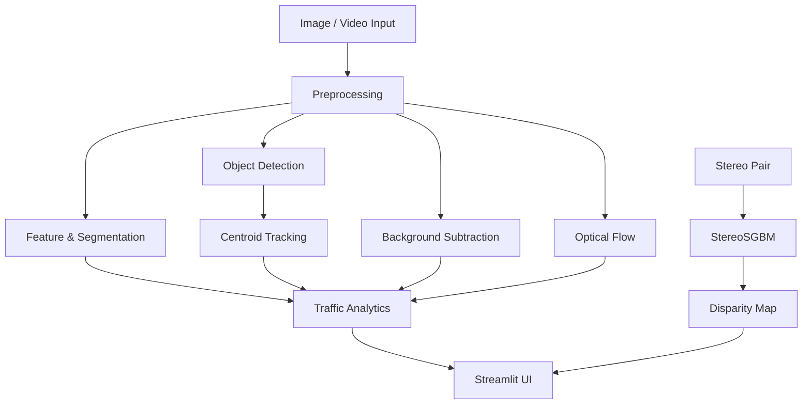

# Architecture

```mermaid
flowchart TD
A[Image / Video Input] --> B[Preprocessing]
B --> C[Feature & Segmentation]
B --> D[Object Detection]
D --> E[Centroid Tracking]
B --> F[Background Subtraction]
B --> G[Optical Flow]
C --> H[Traffic Analytics]
E --> H
F --> H
G --> H
H --> I[Streamlit UI]
J[Stereo Pair] --> K[StereoSGBM]
K --> L[Disparity Map]
L --> I
```
