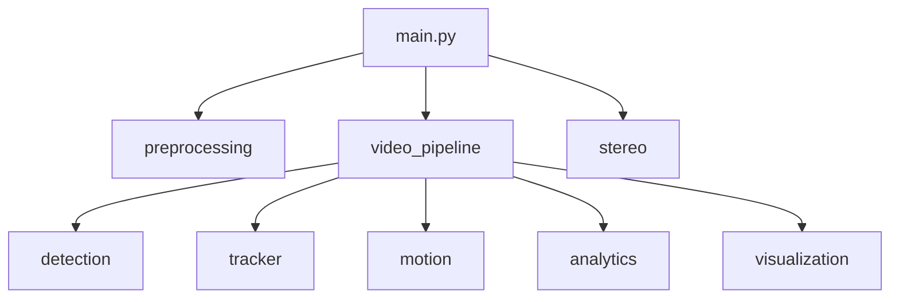

# Components

```mermaid
flowchart TB
UI[main.py] --> PP[preprocessing]
UI --> VP[video_pipeline]
VP --> DET[detection]
VP --> TR[tracker]
VP --> MOT[motion]
UI --> ST[stereo]
VP --> AN[analytics]
VP --> VIS[visualization]
```
