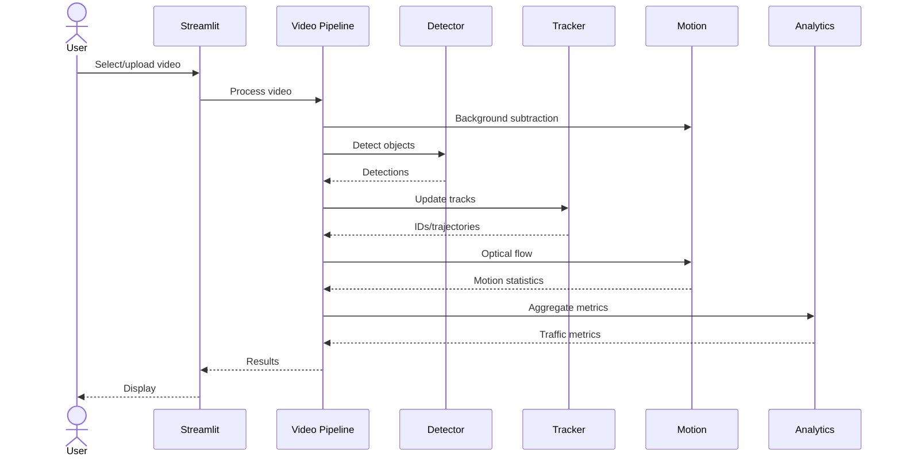

# Sequence

```mermaid
sequenceDiagram
actor User
participant UI as Streamlit
participant P as Video Pipeline
participant D as Detector
participant T as Tracker
participant M as Motion
participant A as Analytics
User->>UI: Select/upload video
UI->>P: Process video
P->>M: Background subtraction
P->>D: Detect objects
D-->>P: Detections
P->>T: Update tracks
T-->>P: IDs/trajectories
P->>M: Optical flow
M-->>P: Motion statistics
P->>A: Aggregate metrics
A-->>P: Traffic metrics
P-->>UI: Results
UI-->>User: Display
```
