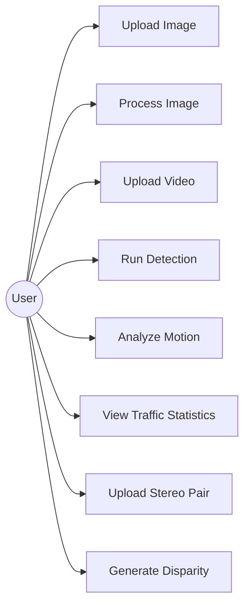

# Use Cases

```mermaid
flowchart LR
U((User)) --> A[Upload Image]
U --> B[Process Image]
U --> C[Upload Video]
U --> D[Run Detection]
U --> E[Analyze Motion]
U --> F[View Traffic Statistics]
U --> G[Upload Stereo Pair]
U --> H[Generate Disparity]
```
