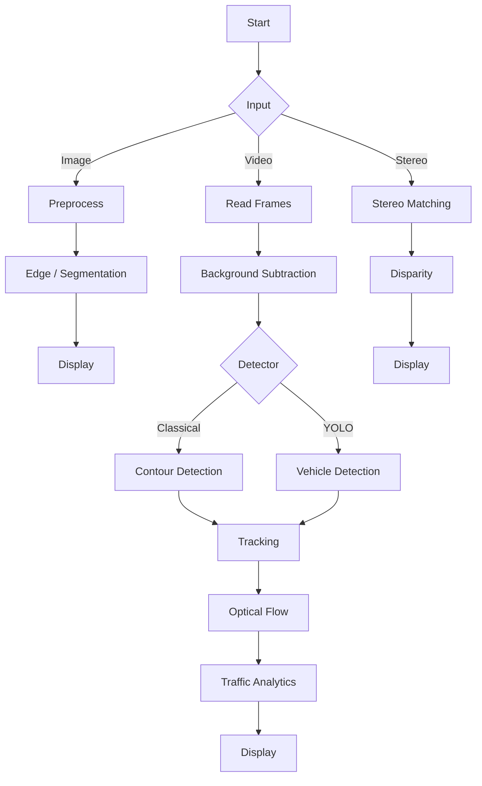

# Workflow

```mermaid
flowchart TD
A[Start] --> B{Input}
B -->|Image| C[Preprocess] --> D[Edge / Segmentation] --> E[Display]
B -->|Video| F[Read Frames] --> G[Background Subtraction] --> H{Detector}
H -->|Classical| I[Contour Detection]
H -->|YOLO| J[Vehicle Detection]
I --> K[Tracking]
J --> K
K --> L[Optical Flow] --> M[Traffic Analytics] --> N[Display]
B -->|Stereo| O[Stereo Matching] --> P[Disparity] --> Q[Display]
```
